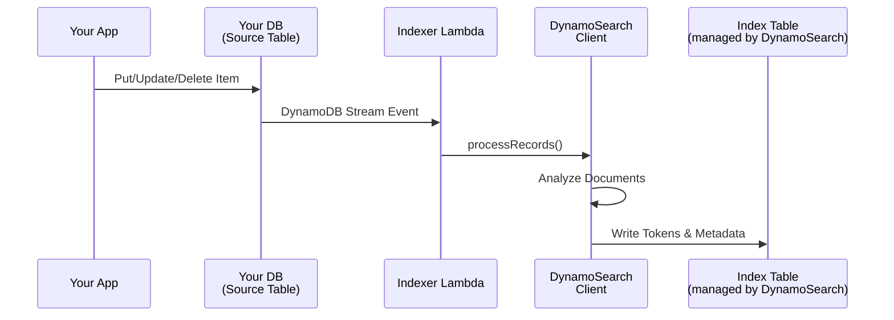
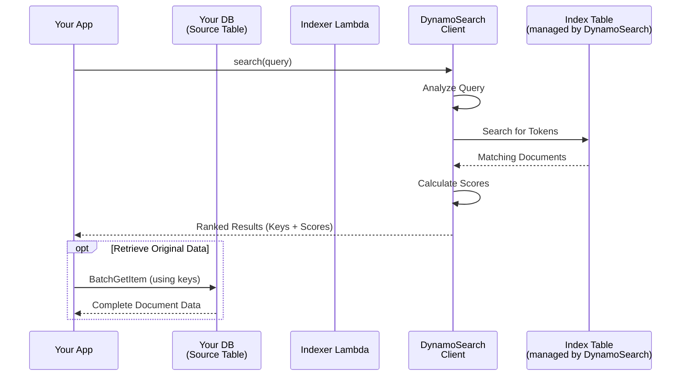

# How It Works

DynamoSearch provides two main workflows: automatic indexing via DynamoDB Streams and search queries with BM25 ranking.

## Indexing Flow

1. **Data Modification**: Your application writes, updates, or deletes items in the source DynamoDB table
2. **Stream Processing**: Changes trigger DynamoDB Streams, which invoke the Indexer Lambda function
3. **Text Analysis**: The DynamoSearch client processes documents through an analyzer (character filters → tokenizer → token filters)
4. **Index Update**: Analyzed tokens are written to the index table with metadata

## Search Flow

1. **Query Submission**: Your application sends a search query to the DynamoSearch client
2. **Query Analysis**: The query text is processed through the same analyzer used for indexing
3. **Token Lookup**: The client queries the index table for documents containing the analyzed tokens
4. **Ranking**: Matching documents are scored using the BM25 algorithm, which considers term frequency, inverse document frequency, and document length normalization
5. **Results**: Ranked results are returned to your application with document keys and relevance scores
6. **Retrieve Original Data (Optional)**: Since DynamoSearch returns only keys and scores, your application can fetch complete document data from the source table
