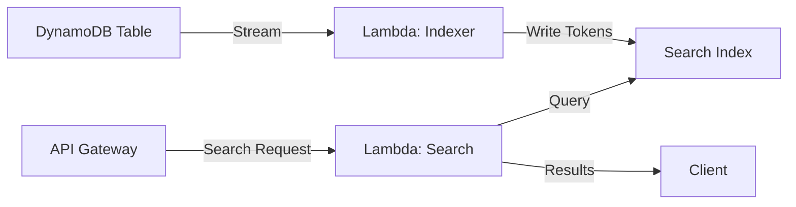

# AWS Lambda Integration

Deploy DynamoSearch to production using AWS Lambda and DynamoDB Streams for automatic indexing.

## Architecture Overview



## Lambda Function: Stream Processor

This function processes DynamoDB Stream events to maintain the search index:

```typescript
// indexer.ts
import type { DynamoDBStreamHandler } from 'aws-lambda';
import DynamoSearch from 'dynamosearch';
import StandardAnalyzer from 'dynamosearch/analyzers/StandardAnalyzer.js';

const analyzer = await StandardAnalyzer.getInstance();
const dynamosearch = new DynamoSearch({
  indexTableName: process.env.INDEX_TABLE_NAME!,
  attributes: [
    { name: 'title', analyzer },
    { name: 'body', analyzer }
  ],
  keys: [
    { name: 'id', type: 'HASH' }
  ]
});

export const handler: DynamoDBStreamHandler = async (event) => {
  await dynamosearch.processRecords(event.Records);
};
```

## Lambda Function: Search API

This function handles search requests:

```typescript
// search.ts
import type { APIGatewayProxyHandler } from 'aws-lambda';
import DynamoSearch from 'dynamosearch';
import StandardAnalyzer from 'dynamosearch/analyzers/StandardAnalyzer.js';

const analyzer = await StandardAnalyzer.getInstance();
const dynamosearch = new DynamoSearch({
  indexTableName: process.env.INDEX_TABLE_NAME!,
  attributes: [
    { name: 'title', analyzer },
    { name: 'body', analyzer }
  ],
  keys: [
    { name: 'id', type: 'HASH' }
  ]
});

export const handler: APIGatewayProxyHandler = async (event) => {
  const query = event.queryStringParameters?.q || '';
  const maxItems = parseInt(event.queryStringParameters?.limit || '20');

  const results = await dynamosearch.search(query, {
    attributes: ['title^2', 'body'],
    maxItems,
    minScore: 0.5
  });

  return {
    statusCode: 200,
    headers: {
      'Content-Type': 'application/json',
      'Access-Control-Allow-Origin': '*'
    },
    body: JSON.stringify({
      query,
      total: results.items.length,
      items: results.items
    })
  };
};
```

## AWS SAM Template

Deploy using AWS SAM (Serverless Application Model):

```yaml
# template.yaml
AWSTemplateFormatVersion: '2010-09-09'
Transform: AWS::Serverless-2016-10-31
Description: DynamoSearch Application

Globals:
  Function:
    Timeout: 30
    Runtime: nodejs22.x
    MemorySize: 512
    Architectures:
      - arm64
    Environment:
      Variables:
        INDEX_TABLE_NAME: !Ref SearchIndexTable

Resources:
  # Source DynamoDB table with Stream enabled
  DocumentsTable:
    Type: AWS::DynamoDB::Table
    Properties:
      TableName: !Sub ${AWS::StackName}-documents
      BillingMode: PAY_PER_REQUEST
      AttributeDefinitions:
        - AttributeName: id
          AttributeType: S
      KeySchema:
        - AttributeName: id
          KeyType: HASH
      StreamSpecification:
        StreamEnabled: true
        StreamViewType: NEW_AND_OLD_IMAGES

  # Search index table
  SearchIndexTable:
    Type: AWS::DynamoDB::Table
    Properties:
      TableName: !Sub ${AWS::StackName}-search-index
      BillingMode: PAY_PER_REQUEST
      AttributeDefinitions:
        - AttributeName: p
          AttributeType: S
        - AttributeName: s
          AttributeType: B
        - AttributeName: k
          AttributeType: S
        - AttributeName: h
          AttributeType: B
      KeySchema:
        - AttributeName: p
          KeyType: HASH
        - AttributeName: s
          KeyType: RANGE
      GlobalSecondaryIndexes:
        - IndexName: keys-index
          KeySchema:
            - AttributeName: k
              KeyType: HASH
          Projection:
            ProjectionType: KEYS_ONLY
        - IndexName: hash-index
          KeySchema:
            - AttributeName: p
              KeyType: HASH
            - AttributeName: h
              KeyType: RANGE
          Projection:
            ProjectionType: KEYS_ONLY

  # Lambda function to process DynamoDB Stream
  IndexerFunction:
    Type: AWS::Serverless::Function
    Metadata:
      BuildMethod: esbuild
      BuildProperties:
        Minify: true
        Target: es2020
        Sourcemap: true
        EntryPoints:
          - src/indexer.ts
        External:
          - '@aws-sdk/*'
    Properties:
      FunctionName: !Sub ${AWS::StackName}-indexer
      CodeUri: ./
      Handler: src/indexer.handler
      Events:
        Stream:
          Type: DynamoDB
          Properties:
            Stream: !GetAtt DocumentsTable.StreamArn
            StartingPosition: LATEST
            BatchSize: 100
            MaximumBatchingWindowInSeconds: 5
      Policies:
        - DynamoDBCrudPolicy:
            TableName: !Ref SearchIndexTable
        - DynamoDBStreamReadPolicy:
            TableName: !Ref DocumentsTable
            StreamName: !Select [3, !Split ["/", !GetAtt DocumentsTable.StreamArn]]

  # Lambda function for search API
  SearchFunction:
    Type: AWS::Serverless::Function
    Metadata:
      BuildMethod: esbuild
      BuildProperties:
        Minify: true
        Target: es2020
        Sourcemap: true
        EntryPoints:
          - src/search.ts
        External:
          - '@aws-sdk/*'
    Properties:
      FunctionName: !Sub ${AWS::StackName}-search
      CodeUri: ./
      Handler: src/search.handler
      Events:
        SearchApi:
          Type: Api
          Properties:
            Path: /search
            Method: get
      Policies:
        - DynamoDBReadPolicy:
            TableName: !Ref SearchIndexTable

Outputs:
  SearchUrl:
    Description: URL to search documents
    Value: !Sub https://${ServerlessRestApi}.execute-api.${AWS::Region}.amazonaws.com/Prod/search
```

## Deployment

### 1. Install SAM CLI

```bash
# macOS
brew install aws-sam-cli

# Windows
choco install aws-sam-cli

# Linux
pip install aws-sam-cli
```

### 2. Build

```bash
sam build
```

### 3. Deploy

```bash
sam deploy --guided
```

Follow the prompts:
- Stack Name: `dynamosearch-app`
- AWS Region: `us-east-1`
- Confirm changes before deploy: `Y`
- Allow SAM CLI IAM role creation: `Y`
- Save arguments to samconfig.toml: `Y`

### 4. Test

```bash
# Get the API endpoint from outputs
SEARCH_URL=$(aws cloudformation describe-stacks \
  --stack-name dynamosearch-app \
  --query 'Stacks[0].Outputs[?OutputKey==`SearchUrl`].OutputValue' \
  --output text)

# Search
curl "${SEARCH_URL}?q=machine%20learning&limit=10"
```

## Performance Optimization

### Batching

Configure stream batching for better throughput:

```yaml
Events:
  Stream:
    Type: DynamoDB
    Properties:
      Stream: !GetAtt DocumentsTable.StreamArn
      StartingPosition: LATEST
      BatchSize: 100                        # Process up to 100 records
      MaximumBatchingWindowInSeconds: 5     # Wait up to 5 seconds
      MaximumRecordAgeInSeconds: 60         # Discard old records
      MaximumRetryAttempts: 3               # Retry failed batches
      ParallelizationFactor: 1              # Process 1 shard at a time
```

### Memory Configuration

Adjust Lambda memory based on workload:

```yaml
Globals:
  Function:
    MemorySize: 1024  # More memory = faster CPU
```

Test different memory sizes:
- 512 MB: Small documents, low volume
- 1024 MB: Medium documents, medium volume
- 2048 MB: Large documents, high volume

### Provisioned Concurrency

For consistent low latency:

```yaml
SearchFunction:
  Type: AWS::Serverless::Function
  Properties:
    # ... other properties
    ProvisionedConcurrencyConfig:
      ProvisionedConcurrentExecutions: 5
```

## Error Handling

### Dead Letter Queue

Capture failed indexing operations:

```yaml
IndexerFunction:
  Type: AWS::Serverless::Function
  Properties:
    # ... other properties
    DeadLetterQueue:
      Type: SQS
      TargetArn: !GetAtt IndexerDLQ.Arn

IndexerDLQ:
  Type: AWS::SQS::Queue
  Properties:
    QueueName: !Sub ${AWS::StackName}-indexer-dlq
    MessageRetentionPeriod: 1209600  # 14 days
```

### CloudWatch Alarms

Monitor for errors:

```yaml
IndexerErrorAlarm:
  Type: AWS::CloudWatch::Alarm
  Properties:
    AlarmName: !Sub ${AWS::StackName}-indexer-errors
    MetricName: Errors
    Namespace: AWS/Lambda
    Statistic: Sum
    Period: 300
    EvaluationPeriods: 1
    Threshold: 5
    ComparisonOperator: GreaterThanThreshold
    Dimensions:
      - Name: FunctionName
        Value: !Ref IndexerFunction
```

## Monitoring

### CloudWatch Logs

View logs:

```bash
sam logs -n IndexerFunction --tail
sam logs -n SearchFunction --tail
```

### Custom Metrics

Publish custom metrics:

```typescript
import { CloudWatchClient, PutMetricDataCommand } from '@aws-sdk/client-cloudwatch';

const cloudwatch = new CloudWatchClient({});

await cloudwatch.send(new PutMetricDataCommand({
  Namespace: 'DynamoSearch',
  MetricData: [{
    MetricName: 'SearchLatency',
    Value: duration,
    Unit: 'Milliseconds',
    Timestamp: new Date()
  }]
}));
```

## Best Practices

1. **Use ARM architecture** - Lower cost, better performance
2. **External AWS SDK** - Reduce bundle size
3. **Enable X-Ray** - Trace requests for debugging
4. **Set appropriate timeouts** - Indexer: 30s, Search: 10s
5. **Use environment variables** - Configure without redeployment
6. **Implement retry logic** - Handle transient failures
7. **Monitor DLQ** - Alert on failed operations
8. **Test locally** - Use `sam local` for development

## Local Development

### Start Local API

```bash
sam local start-api
```

### Invoke Function Locally

```bash
sam local invoke SearchFunction -e events/search.json
```

Create `events/search.json`:

```json
{
  "queryStringParameters": {
    "q": "machine learning",
    "limit": "10"
  }
}
```

## Next Steps

- [Reindexing](/guide/reindexing) - Manage index updates
- [API Reference](/api/dynamosearch) - Complete API documentation
- [Example Application](https://github.com/maruyamaworks/dynamosearch/tree/main/examples/serverless-api) - Full example code
