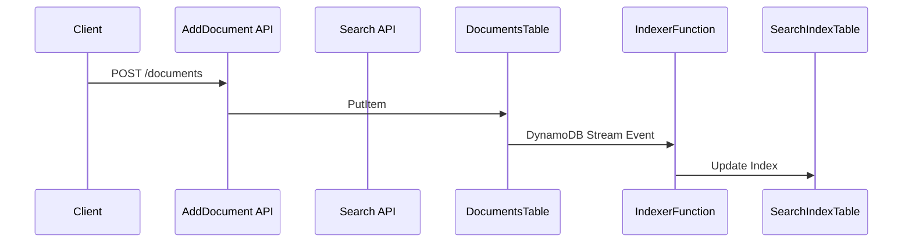
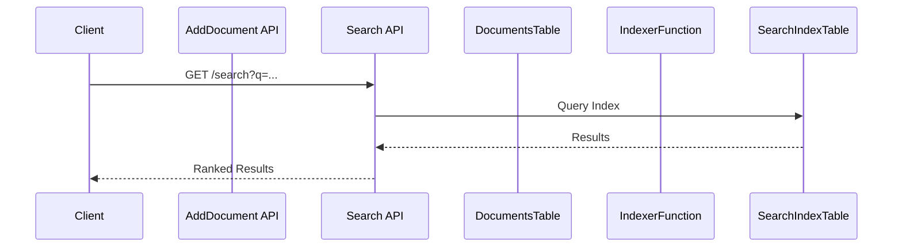

# AWS SAM Example

This guide shows how to deploy DynamoSearch to AWS Lambda using the provided SAM (Serverless Application Model) example.

## Overview

The example in `examples/serverless-api` demonstrates a complete serverless search application with:

- **DocumentsTable**: Source DynamoDB table with Streams enabled
- **SearchIndexTable**: DynamoDB table storing the search index
- **IndexerFunction**: Lambda function that processes Stream events and updates the index
- **SearchFunction**: Lambda function that handles search API requests via API Gateway
- **AddDocumentFunction**: Lambda function that adds documents to the source table

## Prerequisites

- [Node.js 20+](https://nodejs.org/) installed
- [AWS SAM CLI](https://docs.aws.amazon.com/serverless-application-model/latest/developerguide/install-sam-cli.html) installed
- AWS credentials configured

## Quick Start

### 1. Clone and Navigate to the Example

```bash
git clone https://github.com/maruyamaworks/dynamosearch
cd dynamosearch/examples/serverless-api
```

### 2. Install Dependencies

```bash
npm install
```

### 3. Build the Application

```bash
sam build
```

This compiles the TypeScript Lambda functions using esbuild.

### 4. Deploy to AWS

```bash
sam deploy --guided
```

During the guided deployment:
- **Stack name**: Enter a name (e.g., `dynamosearch-demo`)
- **AWS Region**: Select your preferred region
- **Confirm changes before deploy**: `Y`
- **Allow SAM CLI IAM role creation**: `Y`
- **Save arguments to samconfig.toml**: `Y`

The deployment creates:
- Two DynamoDB tables (source + index)
- Three Lambda functions
- API Gateway with two endpoints
- IAM roles and policies

### 5. Get the API Endpoints

After deployment, note the output URLs:

```
Outputs
-------
AddDocumentUrl: https://<api-id>.execute-api.<region>.amazonaws.com/Prod/documents
SearchUrl: https://<api-id>.execute-api.<region>.amazonaws.com/Prod/search
```

## Usage

### Add Documents

```bash
curl -X POST https://<api-id>.execute-api.<region>.amazonaws.com/Prod/documents \
  -H "Content-Type: application/json" \
  -d '{
    "title": "Introduction to AWS Lambda",
    "description": "AWS Lambda is a serverless compute service that runs your code in response to events."
  }'
```

The AddDocumentFunction writes the document to DocumentsTable, which triggers the Stream. The IndexerFunction then processes the Stream event and updates the search index automatically.

### Search Documents

```bash
curl "https://<api-id>.execute-api.<region>.amazonaws.com/Prod/search?q=lambda"
```

Response:

```json
{
  "items": [
    {
      "keys": { "id": { "S": "..." } },
      "score": 2.145
    }
  ],
  "total": 1
}
```

## Architecture

### Indexing Flow



### Search Flow



## Lambda Functions

### IndexerFunction (`src/indexer.ts`)

Processes DynamoDB Stream events:

```typescript
import DynamoSearch from 'dynamosearch';
import StandardAnalyzer from 'dynamosearch/analyzers/StandardAnalyzer';
import type { DynamoDBStreamHandler } from 'aws-lambda';

export const handler: DynamoDBStreamHandler = async (event) => {
  const analyzer = new StandardAnalyzer();
  const dynamosearch = new DynamoSearch({
    indexTableName: process.env.INDEX_TABLE_NAME!,
    fields: [
      { name: 'title', analyzer },
      { name: 'description', analyzer },
    ],
    keySchema: [
      { name: 'id', type: 'HASH' },
    ],
  });
  await dynamosearch.processRecords(event.Records);
};
```

### SearchFunction (`src/search.ts`)

Handles search API requests:

```typescript
import DynamoSearch from 'dynamosearch';
import StandardAnalyzer from 'dynamosearch/analyzers/StandardAnalyzer';
import type { APIGatewayProxyHandler } from 'aws-lambda';

export const handler: APIGatewayProxyHandler = async (event) => {
  const query = event.queryStringParameters?.q;

  const analyzer = new StandardAnalyzer();
  const dynamosearch = new DynamoSearch({
    indexTableName: process.env.INDEX_TABLE_NAME!,
    fields: [
      { name: 'title', analyzer },
      { name: 'description', analyzer },
    ],
    keySchema: [
      { name: 'id', type: 'HASH' },
    ],
  });

  const results = await dynamosearch.search(query, {
    fields: ['title^2', 'description'], // Boost title 2x
    maxItems: 20,
  });

  return {
    statusCode: 200,
    headers: { 'Content-Type': 'application/json' },
    body: JSON.stringify({
      items: results.items,
      total: results.items.length,
    }),
  };
};
```

## Local Development

### Start Local API

```bash
sam local start-api
```

This starts a local API Gateway emulator at `http://127.0.0.1:3000`.

### Test Locally

```bash
# Add a document
curl -X POST http://127.0.0.1:3000/documents \
  -H "Content-Type: application/json" \
  -d '{"title": "Test", "description": "Local test"}'

# Search (requires actual DynamoDB tables)
curl "http://127.0.0.1:3000/search?q=test"
```

## Cleanup

Delete all resources:

```bash
sam delete
```

Confirm the deletion when prompted. This removes:
- DynamoDB tables (including all data)
- Lambda functions
- API Gateway
- CloudWatch log groups
- IAM roles

<style scoped>
.mermaid {
  margin: 32px 0;
}
</style>
