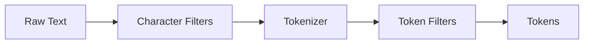

# Text Analysis

Text analysis is the process of converting text into tokens that can be searched. DynamoSearch provides a flexible analysis pipeline inspired by Elasticsearch.

## Analysis Pipeline

The analysis process flows through three stages:



### 1. Character Filters

Character filters preprocess the text before tokenization. They can:
- Normalize Unicode characters
- Remove HTML tags
- Replace patterns

### 2. Tokenizer

The tokenizer splits the text into individual tokens. Only one tokenizer is used per analyzer.

### 3. Token Filters

Token filters modify or remove tokens. Multiple filters can be chained together.

## Built-in Analyzers

### StandardAnalyzer

Best for English and Western languages. Uses word boundaries for tokenization and converts to lowercase.

```typescript
import StandardAnalyzer from 'dynamosearch/analyzers/StandardAnalyzer.js';

const analyzer = await StandardAnalyzer.getInstance();
const tokens = analyzer.analyze('Hello World!');
// [{ text: 'hello' }, { text: 'world' }]
```

**Pipeline:**
- Tokenizer: `StandardTokenizer` (word boundaries using `Intl.Segmenter`)
- Filters: `LowerCaseFilter`

### KeywordAnalyzer

Treats the entire input as a single token. Useful for exact matching on fields like IDs, categories, or tags.

```typescript
import KeywordAnalyzer from 'dynamosearch/analyzers/KeywordAnalyzer.js';

const analyzer = await KeywordAnalyzer.getInstance();
const tokens = analyzer.analyze('product-123');
// [{ text: 'product-123' }]
```

**Pipeline:**
- Tokenizer: `KeywordTokenizer`
- Filters: None

### JapaneseAnalyzer (Plugin)

For Japanese text, use the kuromoji plugin:

```typescript
import JapaneseAnalyzer from '@dynamosearch/plugin-analysis-kuromoji/analyzers/JapaneseAnalyzer.js';

const analyzer = await JapaneseAnalyzer.getInstance();
const tokens = analyzer.analyze('すもももももももものうち');
// [
//   { text: 'すもも' },
//   { text: 'も' },
//   { text: 'もも' },
//   { text: 'も' },
//   { text: 'もも' },
//   { text: 'の' },
//   { text: 'うち' }
// ]
```

## Built-in Components

### Tokenizers

#### StandardTokenizer

Uses `Intl.Segmenter` for word boundary detection:

```typescript
import StandardTokenizer from 'dynamosearch/tokenizers/StandardTokenizer.js';

const tokenizer = await StandardTokenizer.getInstance();
const tokens = tokenizer.tokenize('Hello, World!');
// [{ text: 'Hello' }, { text: 'World' }]
```

#### IntlSegmenterTokenizer

Similar to StandardTokenizer but with explicit locale support:

```typescript
import IntlSegmenterTokenizer from 'dynamosearch/tokenizers/IntlSegmenterTokenizer.js';

const tokenizer = await IntlSegmenterTokenizer.getInstance({ locale: 'en' });
```

#### NGramTokenizer

Creates n-grams from text:

```typescript
import NGramTokenizer from 'dynamosearch/tokenizers/NGramTokenizer.js';

const tokenizer = await NGramTokenizer.getInstance({ min: 2, max: 3 });
const tokens = tokenizer.tokenize('hello');
// [
//   { text: 'he' }, { text: 'el' }, { text: 'll' }, { text: 'lo' },
//   { text: 'hel' }, { text: 'ell' }, { text: 'llo' }
// ]
```

#### PathHierarchyTokenizer

Splits paths into hierarchical components:

```typescript
import PathHierarchyTokenizer from 'dynamosearch/tokenizers/PathHierarchyTokenizer.js';

const tokenizer = await PathHierarchyTokenizer.getInstance({ delimiter: '/' });
const tokens = tokenizer.tokenize('/usr/local/bin');
// [
//   { text: '/usr' },
//   { text: '/usr/local' },
//   { text: '/usr/local/bin' }
// ]
```

#### KeywordTokenizer

Returns the entire input as a single token:

```typescript
import KeywordTokenizer from 'dynamosearch/tokenizers/KeywordTokenizer.js';

const tokenizer = await KeywordTokenizer.getInstance();
const tokens = tokenizer.tokenize('exact-match');
// [{ text: 'exact-match' }]
```

### Token Filters

#### LowerCaseFilter

Converts all tokens to lowercase:

```typescript
import LowerCaseFilter from 'dynamosearch/filters/LowerCaseFilter.js';

const filter = LowerCaseFilter();
const tokens = filter([{ text: 'Hello' }, { text: 'WORLD' }]);
// [{ text: 'hello' }, { text: 'world' }]
```

#### CJKWidthFilter

Normalizes CJK (Chinese, Japanese, Korean) character widths:

```typescript
import CJKWidthFilter from 'dynamosearch/filters/CJKWidthFilter.js';

const filter = CJKWidthFilter();
const tokens = filter([{ text: 'ＡＢＣ' }]);
// [{ text: 'ABC' }]
```

## Custom Analyzers

Create custom analyzers by composing components:

```typescript
import Analyzer from 'dynamosearch/analyzers/Analyzer.js';
import StandardTokenizer from 'dynamosearch/tokenizers/StandardTokenizer.js';
import LowerCaseFilter from 'dynamosearch/filters/LowerCaseFilter.js';

class MyAnalyzer extends Analyzer {
  static async getInstance() {
    return new MyAnalyzer({
      charFilters: [],
      tokenizer: await StandardTokenizer.getInstance(),
      filters: [LowerCaseFilter()]
    });
  }
}

const analyzer = await MyAnalyzer.getInstance();
```

### Custom Character Filter

```typescript
const htmlStripFilter = (str: string): string => {
  return str.replace(/<[^>]*>/g, '');
};

class HtmlAnalyzer extends Analyzer {
  static async getInstance() {
    return new HtmlAnalyzer({
      charFilters: [htmlStripFilter],
      tokenizer: await StandardTokenizer.getInstance(),
      filters: [LowerCaseFilter()]
    });
  }
}
```

### Custom Token Filter

```typescript
import type { TokenFilter } from 'dynamosearch/analyzers/Analyzer.js';

const stopWordsFilter = (stopWords: string[]): TokenFilter => {
  const stopWordsSet = new Set(stopWords);
  return (tokens) => tokens.filter(token => !stopWordsSet.has(token.text));
};

class EnglishAnalyzer extends Analyzer {
  static async getInstance() {
    const stopWords = ['the', 'a', 'an', 'and', 'or', 'but'];
    return new EnglishAnalyzer({
      charFilters: [],
      tokenizer: await StandardTokenizer.getInstance(),
      filters: [
        LowerCaseFilter(),
        stopWordsFilter(stopWords)
      ]
    });
  }
}
```

## Choosing an Analyzer

| Use Case | Recommended Analyzer |
|----------|---------------------|
| English text | `StandardAnalyzer` |
| Japanese text | `JapaneseAnalyzer` (plugin) |
| Exact matching (IDs, categories) | `KeywordAnalyzer` |
| Partial matching | Custom with `NGramTokenizer` |
| File paths | Custom with `PathHierarchyTokenizer` |

## Per-Attribute Analyzers

Different fields can use different analyzers:

```typescript
import StandardAnalyzer from 'dynamosearch/analyzers/StandardAnalyzer.js';
import KeywordAnalyzer from 'dynamosearch/analyzers/KeywordAnalyzer.js';

const standardAnalyzer = await StandardAnalyzer.getInstance();
const keywordAnalyzer = await KeywordAnalyzer.getInstance();

const dynamosearch = new DynamoSearch({
  indexTableName: 'search-index',
  attributes: [
    { name: 'title', analyzer: standardAnalyzer },
    { name: 'content', analyzer: standardAnalyzer },
    { name: 'category', analyzer: keywordAnalyzer }
  ],
  keys: [{ name: 'id', type: 'HASH' }]
});
```

## Testing Your Analyzer

Test your analyzer to ensure it produces expected tokens:

```typescript
const analyzer = await MyAnalyzer.getInstance();
const tokens = analyzer.analyze('Your test text here');
console.log(tokens);
```
