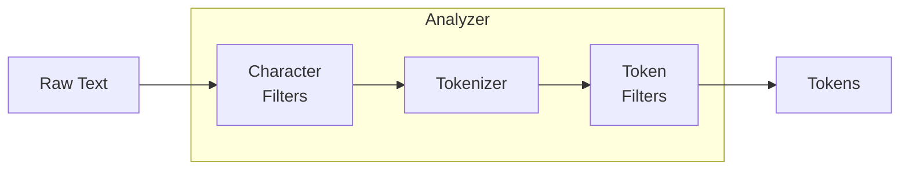

# Text Analysis

Text analysis is the process of converting text into tokens that can be searched. DynamoSearch provides a flexible analysis pipeline inspired by Elasticsearch.

## Analysis Pipeline

The analysis process flows through three stages:


```mermaid
graph LR
    A[Raw Text] --> B[Character<br>Filters]
    subgraph Analyzer
        B --> C[Tokenizer]
        C --> D[Token<br>Filters]
    end
    D --> E[Tokens]
```

### Analyzer

```typescript
interface AnalyzerOptions {
  tokenizer: Tokenizer;
  charFilters?: CharacterFilter[];
  filters?: TokenFilter[];
}

class Analyzer {
  constructor(options: AnalyzerOptions);
  analyze(str: string): Promise<Token[]>;
}

interface Token {
  token: string;
  startOffset: number;
  endOffset: number;
  position: number;
  keyword?: boolean;
}
```

### Tokenizer

The tokenizer splits the text into individual tokens. Only one tokenizer is used per analyzer.

```typescript
class Tokenizer {
  tokenize(str: string): Promise<Token[]>;
}
```

### Token Filters

Token filters modify or remove tokens. Multiple filters can be chained together.

```typescript
class TokenFilter {
  apply(tokens: Token[]): Token[];
}
```

### Character Filters

Character filters preprocess the text before tokenization. They transform the raw input string.

```typescript
class CharacterFilter {
  apply(str: string): string;
}
```

## Built-in Components

DynamoSearch provides several built-in analyzers, tokenizers, and filters. For detailed specifications, see the [Reference](/reference/) section.

### Analyzers

See [Built-in Analyzers](/reference/analyzers/) for complete specifications.

### Tokenizers

See [Built-in Tokenizers](/reference/tokenizers/) for complete specifications.

### Token Filters

See [Built-in Token Filters](/reference/filters/) for complete specifications.

### Character Filters

See [Built-in Character Filters](/reference/char-filters/) for complete specifications.

## Custom Components

You can create custom analyzers, tokenizers, and filters by implementing the appropriate interfaces.

### Custom Analyzer

Create a custom analyzer by extending the `Analyzer` class and composing character filters, a tokenizer, and token filters:

```typescript
import Analyzer from 'dynamosearch/analyzers/Analyzer';
import StandardTokenizer from 'dynamosearch/tokenizers/StandardTokenizer';
import LowerCaseFilter from 'dynamosearch/filters/LowerCaseFilter';

class MyAnalyzer extends Analyzer {
  constructor() {
    super({
      charFilters: [],
      tokenizer: new StandardTokenizer(),
      filters: [new LowerCaseFilter()],
    });
  }
}

const analyzer = new MyAnalyzer();
const tokens = await analyzer.analyze('Hello World');
// [
//   { token: 'hello', startOffset: 0, endOffset: 5, position: 0 },
//   { token: 'world', startOffset: 6, endOffset: 11, position: 1 }
// ]
```

### Custom Tokenizer

Implement a custom tokenizer by extending the `Tokenizer` class:

```typescript
import Tokenizer from 'dynamosearch/tokenizers/Tokenizer';
import type { Token } from 'dynamosearch/tokenizers/Tokenizer';

class CommaTokenizer extends Tokenizer {
  async tokenize(str: string): Promise<Token[]> {
    const parts = str.split(',');
    let position = 0;
    return parts.map((text, i) => {
      const trimmed = text.trim();
      const startOffset = str.indexOf(trimmed, position);
      const endOffset = startOffset + trimmed.length;
      position = endOffset;
      return {
        token: trimmed,
        startOffset,
        endOffset,
        position: i,
      };
    });
  }
}

const tokenizer = new CommaTokenizer();
const tokens = await tokenizer.tokenize('foo, bar, baz');
// [
//   { token: 'foo', startOffset: 0, endOffset: 3, position: 0 },
//   { token: 'bar', startOffset: 5, endOffset: 8, position: 1 },
//   { token: 'baz', startOffset: 10, endOffset: 13, position: 2 }
// ]
```

### Custom Token Filter

Create a custom token filter as a function that transforms an array of tokens:

```typescript
import TokenFilter from 'dynamosearch/filters/TokenFilter';
import type { Token } from 'dynamosearch/tokenizers/Tokenizer';

class StopWordsFilter extends TokenFilter {
  private stopWordsSet: Set<string>;

  constructor(stopWords: string[]) {
    super();
    this.stopWordsSet = new Set(stopWords);
  }

  apply(tokens: Token[]): Token[] {
    return tokens.filter(token => !this.stopWordsSet.has(token.token));
  }
}

class EnglishAnalyzer extends Analyzer {
  constructor() {
    super({
      charFilters: [],
      tokenizer: new StandardTokenizer(),
      filters: [
        new LowerCaseFilter(),
        new StopWordsFilter(['the', 'a', 'an', 'and', 'or', 'but']),
      ],
    });
  }
}

const analyzer = new EnglishAnalyzer();
const tokens = await analyzer.analyze('The quick brown fox');
// [
//   { token: 'quick', startOffset: 4, endOffset: 9, position: 1 },
//   { token: 'brown', startOffset: 10, endOffset: 15, position: 2 },
//   { token: 'fox', startOffset: 16, endOffset: 19, position: 3 }
// ]
```

### Custom Character Filter

Create a custom character filter as a function that transforms a string:

```typescript
import CharacterFilter from 'dynamosearch/char_filters/CharacterFilter';

class HtmlStripFilter extends CharacterFilter {
  apply(str: string): string {
    return str.replace(/<[^>]*>/g, '');
  }
}

class HtmlAnalyzer extends Analyzer {
  constructor() {
    super({
      charFilters: [new HtmlStripFilter()],
      tokenizer: new StandardTokenizer(),
      filters: [new LowerCaseFilter()],
    });
  }
}

const analyzer = new HtmlAnalyzer();
const tokens = await analyzer.analyze('<p>Hello</p> World');
// [
//   { token: 'hello', startOffset: 0, endOffset: 5, position: 0 },
//   { token: 'world', startOffset: 6, endOffset: 11, position: 1 }
// ]
```

## Per-Field Analyzers

Different fields can use different analyzers:

```typescript
import StandardAnalyzer from 'dynamosearch/analyzers/StandardAnalyzer';
import KeywordAnalyzer from 'dynamosearch/analyzers/KeywordAnalyzer';

const standardAnalyzer = new StandardAnalyzer();
const keywordAnalyzer = new KeywordAnalyzer();

const dynamosearch = new DynamoSearch({
  indexTableName: 'articles-index',
  fields: [
    { name: 'title', analyzer: standardAnalyzer },
    { name: 'content', analyzer: standardAnalyzer },
    { name: 'category', analyzer: keywordAnalyzer },
  ],
  keySchema: [{ name: 'id', type: 'HASH' }],
});
```
