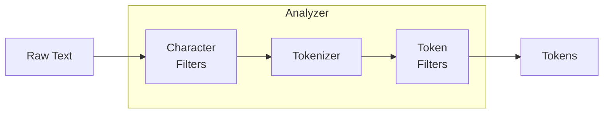

# Text Analysis

Text analysis is the process of converting text into tokens that can be searched. DynamoSearch provides a flexible analysis pipeline inspired by Elasticsearch.

## Analysis Pipeline

The analysis process flows through three stages:


```mermaid
graph LR
    A[Raw Text] --> B[Character<br>Filters]
    subgraph Analyzer
        B --> C[Tokenizer]
        C --> D[Token<br>Filters]
    end
    D --> E[Tokens]
```

### Analyzer

```typescript
interface AnalyzerOptions {
  tokenizer: Tokenizer;
  charFilters?: CharacterFilter[];
  filters?: TokenFilter[];
}

class Analyzer {
  constructor(options: AnalyzerOptions);
  analyze(str: string): Promise<{ text: string }[]>;
}
```

### Tokenizer

The tokenizer splits the text into individual tokens. Only one tokenizer is used per analyzer.

```typescript
class Tokenizer {
  tokenize(str: string): Promise<{ text: string }[]>;
}
```

### Token Filters

Token filters modify or remove tokens. Multiple filters can be chained together.

```typescript
type TokenFilter = (tokens: { text: string }[]) => { text: string }[];
```

### Character Filters

Character filters preprocess the text before tokenization. They transform the raw input string.

```typescript
type CharacterFilter = (str: string) => string;
```

## Built-in Components

DynamoSearch provides several built-in analyzers, tokenizers, and filters. For detailed specifications, see the [Reference](/reference/) section.

### Analyzers

See [Built-in Analyzers](/reference/analyzers) for complete specifications.

### Tokenizers

See [Built-in Tokenizers](/reference/tokenizers) for complete specifications.

### Token Filters

See [Built-in Token Filters](/reference/filters) for complete specifications.

### Character Filters

See [Built-in Character Filters](/reference/char-filters) for complete specifications.

## Custom Components

You can create custom analyzers, tokenizers, and filters by implementing the appropriate interfaces.

### Custom Analyzer

Create a custom analyzer by extending the `Analyzer` class and composing character filters, a tokenizer, and token filters:

```typescript
import Analyzer from 'dynamosearch/analyzers/Analyzer';
import StandardTokenizer from 'dynamosearch/tokenizers/StandardTokenizer';
import LowerCaseFilter from 'dynamosearch/filters/LowerCaseFilter';

class MyAnalyzer extends Analyzer {
  constructor() {
    super({
      charFilters: [],
      tokenizer: new StandardTokenizer(),
      filters: [LowerCaseFilter()],
    });
  }
}

const analyzer = new MyAnalyzer();
const tokens = await analyzer.analyze('Hello World');
// [{ text: 'hello' }, { text: 'world' }]
```

### Custom Tokenizer

Implement a custom tokenizer by extending the `Tokenizer` class:

```typescript
import Tokenizer from 'dynamosearch/tokenizers/Tokenizer';

class CommaTokenizer extends Tokenizer {
  async tokenize(str: string): Promise<{ text: string }[]> {
    return str.split(',').map(text => ({ text: text.trim() }));
  }
}

const tokenizer = new CommaTokenizer();
const tokens = await tokenizer.tokenize('foo, bar, baz');
// [{ text: 'foo' }, { text: 'bar' }, { text: 'baz' }]
```

### Custom Token Filter

Create a custom token filter as a function that transforms an array of tokens:

```typescript
import type { TokenFilter } from 'dynamosearch/analyzers/Analyzer';

const stopWordsFilter = (stopWords: string[]): TokenFilter => {
  const stopWordsSet = new Set(stopWords);
  return (tokens) => tokens.filter(token => !stopWordsSet.has(token.text));
};

class EnglishAnalyzer extends Analyzer {
  constructor() {
    super({
      charFilters: [],
      tokenizer: new StandardTokenizer(),
      filters: [
        LowerCaseFilter(),
        stopWordsFilter(['the', 'a', 'an', 'and', 'or', 'but']),
      ],
    });
  }
}

const analyzer = new EnglishAnalyzer();
const tokens = await analyzer.analyze('The quick brown fox');
// [{ text: 'quick' }, { text: 'brown' }, { text: 'fox' }]
```

### Custom Character Filter

Create a custom character filter as a function that transforms a string:

```typescript
import type { CharacterFilter } from 'dynamosearch/analyzers/Analyzer';

const htmlStripFilter: CharacterFilter = (str: string): string => {
  return str.replace(/<[^>]*>/g, '');
};

class HtmlAnalyzer extends Analyzer {
  constructor() {
    super({
      charFilters: [htmlStripFilter],
      tokenizer: new StandardTokenizer(),
      filters: [LowerCaseFilter()],
    });
  }
}

const analyzer = new HtmlAnalyzer();
const tokens = await analyzer.analyze('<p>Hello</p> World');
// [{ text: 'hello' }, { text: 'world' }]
```

## Per-Attribute Analyzers

Different fields can use different analyzers:

```typescript
import StandardAnalyzer from 'dynamosearch/analyzers/StandardAnalyzer';
import KeywordAnalyzer from 'dynamosearch/analyzers/KeywordAnalyzer';

const standardAnalyzer = new StandardAnalyzer();
const keywordAnalyzer = new KeywordAnalyzer();

const dynamosearch = new DynamoSearch({
  indexTableName: 'articles-index',
  attributes: [
    { name: 'title', analyzer: standardAnalyzer },
    { name: 'content', analyzer: standardAnalyzer },
    { name: 'category', analyzer: keywordAnalyzer },
  ],
  keys: [{ name: 'id', type: 'HASH' }],
});
```
