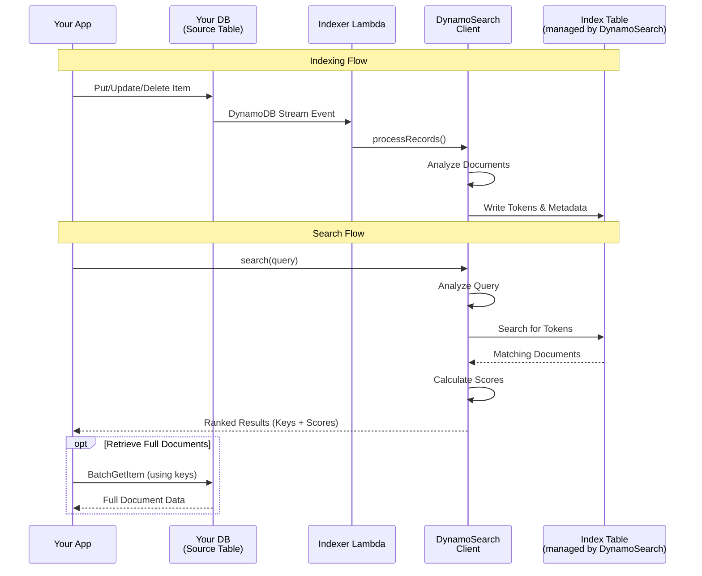

# Why DynamoSearch

DynamoSearch is a full-text search library for AWS DynamoDB that enables powerful search capabilities on your DynamoDB tables. It processes DynamoDB Streams to build and maintain a search index, implementing the BM25 scoring algorithm for relevance ranking.

## The Problems

DynamoDB is an excellent NoSQL database, but it lacks built-in full-text search capabilities. While you could use Amazon OpenSearch Service or Amazon CloudSearch, these add significant cost and operational complexity to your infrastructure.

DynamoSearch solves this by:

- **Using only DynamoDB**: No additional services required
- **Stream-based updates**: Automatically indexes changes via DynamoDB Streams
- **BM25 ranking**: Industry-standard relevance scoring, also used by Elasticsearch
- **Flexible text analysis**: Pluggable analyzers for different languages and use cases
- **Cost-effective**: Pay only for DynamoDB operations

## How It Works

DynamoSearch provides two main workflows: automatic indexing via DynamoDB Streams and search queries with BM25 ranking.

### Indexing Flow

1. **Data Modification**: Your application writes, updates, or deletes items in the source DynamoDB table
2. **Stream Processing**: Changes trigger DynamoDB Streams, which invoke the Indexer Lambda function
3. **Text Analysis**: The DynamoSearch client processes documents through an analyzer (character filters → tokenizer → token filters)
4. **Index Update**: Analyzed tokens are written to the index table with occurrence counts, document length, and metadata

### Search Flow

1. **Query Submission**: Your application sends a search query to the DynamoSearch client
2. **Query Analysis**: The query text is processed through the same analyzer used for indexing
3. **Token Lookup**: The client queries the index table for documents containing the analyzed tokens
4. **Ranking**: Matching documents are scored using the BM25 algorithm, which considers term frequency, inverse document frequency, and document length normalization
5. **Results**: Ranked results are returned to your application with document keys and relevance scores
6. **Retrieve Full Documents (Optional)**: Since DynamoSearch returns only keys and scores, your application can fetch complete document data from the source table
