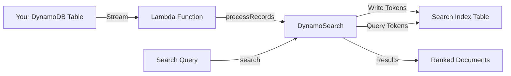

# What is DynamoSearch?

DynamoSearch is a full-text search library for AWS DynamoDB that enables powerful search capabilities on your DynamoDB tables. It processes DynamoDB Streams to build and maintain a search index, implementing the BM25 scoring algorithm for relevance ranking.

## Why DynamoSearch?

DynamoDB is an excellent NoSQL database, but it lacks built-in full-text search capabilities. While you could use Amazon OpenSearch Service or Amazon CloudSearch, these add significant cost and operational complexity to your infrastructure.

DynamoSearch solves this by:

- **Using only DynamoDB**: No additional services required
- **Stream-based updates**: Automatically indexes changes via DynamoDB Streams
- **BM25 ranking**: Industry-standard relevance scoring
- **Flexible text analysis**: Pluggable analyzers for different languages and use cases
- **Cost-effective**: Pay only for DynamoDB operations

## How It Works



1. **Indexing**: When data changes in your DynamoDB table, Stream events trigger a Lambda function
2. **Analysis**: Text is processed through an analyzer (character filters → tokenizer → token filters)
3. **Storage**: Tokens are stored in a search index table with occurrence counts and document metadata
4. **Search**: Queries are analyzed and matched against the index, with BM25 scoring for ranking

## Key Features

### BM25 Scoring

DynamoSearch implements the BM25 algorithm, which considers:
- **Term frequency**: How often a term appears in a document
- **Inverse document frequency**: How rare a term is across all documents
- **Document length normalization**: Adjusts scores based on document length

### Text Analysis Pipeline

Inspired by Elasticsearch, the analysis pipeline consists of:

1. **Character Filters**: Preprocess text (e.g., normalize Unicode characters)
2. **Tokenizer**: Split text into tokens (words, n-grams, etc.)
3. **Token Filters**: Transform tokens (lowercase, stemming, etc.)

### Built-in Analyzers

- **StandardAnalyzer**: Word-based tokenization with lowercase normalization (English)
- **KeywordAnalyzer**: Treats entire input as a single token (exact matching)
- **JapaneseAnalyzer**: Japanese morphological analysis (via kuromoji plugin)

## When to Use DynamoSearch

DynamoSearch is ideal for:

- ✅ Small to medium-sized datasets (up to millions of documents)
- ✅ Serverless architectures
- ✅ Cost-sensitive applications
- ✅ Applications already using DynamoDB
- ✅ Simple to moderate search requirements

Consider other solutions for:

- ❌ Very large datasets (hundreds of millions of documents)
- ❌ Complex search features (facets, aggregations, etc.)
- ❌ Sub-millisecond search latency requirements
- ❌ Full-text search with heavy query load

## Example

```typescript
import DynamoSearch from 'dynamosearch';
import StandardAnalyzer from 'dynamosearch/analyzers/StandardAnalyzer.js';

const analyzer = await StandardAnalyzer.getInstance();
const dynamosearch = new DynamoSearch({
  indexTableName: 'my-search-index',
  attributes: [
    { name: 'title', analyzer },
    { name: 'body', analyzer },
  ],
  keys: [
    { name: 'id', type: 'HASH' },
  ],
});

// Search with attribute boosting
const results = await dynamosearch.search('machine learning', {
  attributes: ['title^2', 'body'], // Boost title 2x
  maxItems: 20,
  minScore: 0.5,
});
```
